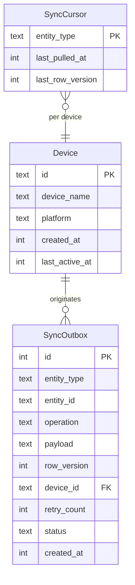

# Data Model: Workspace Foundation

**Branch**: `001-workspace-foundation`
**Date**: 2026-03-19

## Overview

This phase creates only the foundational entities required for device identity, sync infrastructure skeleton, and migration tracking. Feature-specific tables (products, clients, invoices, etc.) are added in Phase 2.

---

## Entities

### Device

Represents a physical device running the app. Generated on first launch.

| Field | Type | Constraints | Description |
|-------|------|-------------|-------------|
| id | UUID (text) | PK | Unique device identifier, generated on first launch |
| device_name | text | not null | Human-readable device label (e.g., OS + model) |
| platform | text | not null | "android" or "windows" |
| created_at | integer (epoch ms) | not null | Timestamp of first launch |
| last_active_at | integer (epoch ms) | not null | Timestamp of last app open |

**Validation rules**:
- `id` is a UUID v4 string, generated once and never changed
- `platform` must be one of: `android`, `windows`

**State transitions**: None — devices are created once and updated on each launch.

---

### SyncOutbox

Local queue of mutations waiting to be pushed to the server. Skeleton structure in this phase; populated by feature phases.

| Field | Type | Constraints | Description |
|-------|------|-------------|-------------|
| id | integer | PK, autoincrement | Local sequence ID |
| entity_type | text | not null | Type of entity (e.g., "product", "invoice") |
| entity_id | text (UUID) | not null | ID of the affected entity |
| operation | text | not null | "create", "update", or "void" |
| payload | text (JSON) | not null | Snapshot of the mutation data |
| row_version | integer | not null | Version of the entity at time of mutation |
| device_id | text (UUID) | not null, FK → Device.id | Originating device |
| retry_count | integer | not null, default 0 | Number of push attempts |
| status | text | not null, default "pending" | "pending", "sent", "failed", "confirmed" |
| created_at | integer (epoch ms) | not null | Timestamp of mutation |

**Validation rules**:
- `operation` must be one of: `create`, `update`, `void`
- `status` must be one of: `pending`, `sent`, `failed`, `confirmed`
- `entity_type` is validated against known entity types (expanded in later phases)

**State transitions**:
```
pending → sent → confirmed
pending → sent → failed → pending (retry)
```

---

### SyncCursor

Tracks the last-pull position for each entity type from the server.

| Field | Type | Constraints | Description |
|-------|------|-------------|-------------|
| entity_type | text | PK | Type of entity being tracked |
| last_pulled_at | integer (epoch ms) | not null | Server timestamp of last successful pull |
| last_row_version | integer | not null, default 0 | Highest row version received |

---

## Relationships



## Notes

- **No server-side tables in this phase** for Device or SyncOutbox. The server-side schema for devices is created in Phase 3 (Sync Foundation) when the device registration endpoint is built.
- **Serverpod's auth tables** are managed by Serverpod's auth module automatically (user info, auth keys, etc.). We do not define them manually.
- **All timestamps** are stored as integer epoch milliseconds for consistency with the constitution's financial timestamp requirements.
- **UUID strings** are stored as text in SQLite. Drift handles the mapping.
