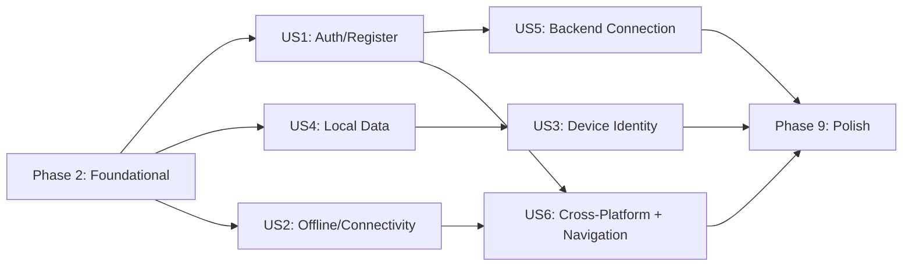

# Tasks: Workspace Foundation

**Input**: Design documents from `specs/001-workspace-foundation/`
**Prerequisites**: plan.md, spec.md, research.md, data-model.md, contracts/, quickstart.md

**Tests**: Not explicitly requested in the spec — test tasks are omitted. Verification is covered via quickstart.md checks and acceptance scenarios.

**Organization**: Tasks are grouped by user story to enable independent implementation and testing of each story.

## Format: `[ID] [P?] [Story] Description`

- **[P]**: Can run in parallel (different files, no dependencies)
- **[Story]**: Which user story this task belongs to (e.g., US1, US2, US3)
- Include exact file paths in descriptions

---

## Phase 1: Setup (Shared Infrastructure)

**Purpose**: Project creation and dependency installation

- [X] T001 Create Serverpod project using `serverpod create motaz_app` in repository root
- [X] T002 Create Flutter app shell at `motaz_app/motaz_app_flutter/` (auto-generated by Serverpod) with Android + Windows platform support
- [X] T003 [P] Add Flutter dependencies to `motaz_app/motaz_app_flutter/pubspec.yaml`: flutter_riverpod, riverpod_annotation, drift, sqlite3_flutter_libs, path_provider, path, connectivity_plus, go_router, uuid, serverpod_auth_email_flutter, motaz_app_client
- [X] T004 [P] Add dev dependencies to `motaz_app/motaz_app_flutter/pubspec.yaml`: flutter_test, drift_dev, build_runner, riverpod_generator
- [X] T005 Run `dart run build_runner build --delete-conflicting-outputs` in `motaz_app/motaz_app_flutter/` to verify code generation setup

**Checkpoint**: Project compiles, all dependencies resolve, code generation runs without errors

---

## Phase 2: Foundational (Blocking Prerequisites)

**Purpose**: Core infrastructure that MUST be complete before ANY user story can be implemented

**⚠️ CRITICAL**: No user story work can begin until this phase is complete

- [X] T006 Configure Neon PostgreSQL connection in `motaz_app_server/config/development.yaml` and create `motaz_app_server/config/passwords.yaml` (gitignored)
- [X] T007 Create Drift database class at `motaz_app/motaz_app_flutter/lib/core/database/app_database.dart` with initial empty schema and database open/close logic
- [X] T008 [P] Create Device table definition at `motaz_app/motaz_app_flutter/lib/core/database/tables/devices.dart` with fields: id (text PK), device_name (text), platform (text), created_at (integer), last_active_at (integer)
- [X] T009 [P] Create SyncOutbox table definition at `motaz_app/motaz_app_flutter/lib/core/database/tables/sync_outbox.dart` with fields: id (integer PK autoincrement), entity_type (text), entity_id (text), operation (text), payload (text), row_version (integer), device_id (text FK), retry_count (integer), status (text), created_at (integer)
- [X] T010 [P] Create SyncCursor table definition at `motaz_app/motaz_app_flutter/lib/core/database/tables/sync_cursor.dart` with fields: entity_type (text PK), last_pulled_at (integer), last_row_version (integer)
- [X] T011 Register all tables in `motaz_app/motaz_app_flutter/lib/core/database/app_database.dart` and run `dart run build_runner build` to generate Drift code
- [X] T012 Create Riverpod provider for AppDatabase at `motaz_app/motaz_app_flutter/lib/core/database/database_provider.dart` — singleton instance, initialized on app start
- [X] T013 [P] Create app theme with Arabic RTL support at `motaz_app/motaz_app_flutter/lib/core/theme/app_theme.dart` — dark/light theme, Arabic font (e.g., Cairo or Noto Sans Arabic), RTL text direction
- [X] T014 [P] Create Arabic localization ARB file at `motaz_app/motaz_app_flutter/lib/core/l10n/app_ar.arb` with base strings: app name, sign in, register, sign out, dashboard, products, clients, invoices, receipts, expenses, returns, reports, party balances, settings, connectivity status labels, error messages
- [X] T015 Configure localization in `motaz_app/motaz_app_flutter/lib/app.dart` — set Arabic as default and only locale, enable flutter_localizations, set text direction RTL
- [X] T016 Create Riverpod ProviderScope and app entry point at `motaz_app/motaz_app_flutter/lib/main.dart` — initialize database, wrap app in ProviderScope

**Checkpoint**: Foundation ready — local database opens, theme renders Arabic RTL, localization works, Riverpod initialized. No screens yet.

---

## Phase 3: User Story 1 — Owner Opens the App / Registers / Signs In (Priority: P1) 🎯 MVP

**Goal**: The owner can launch the app, register on first launch, and sign in on subsequent launches. Sessions persist indefinitely.

**Independent Test**: Install the app, launch it, complete registration, close the app, reopen it — owner should be auto-signed-in.

### Implementation for User Story 1

- [ ] T017 [US1] Implement Serverpod email+password auth setup in `motaz_app_server/lib/src/endpoints/` — enable Serverpod auth module with email+password provider
- [ ] T018 [US1] Add single-account enforcement logic on the server — reject registration if an account already exists in `motaz_app_server/lib/src/endpoints/auth_endpoint.dart`
- [ ] T019 [US1] Create auth state provider at `motaz_app/motaz_app_flutter/lib/core/auth/auth_provider.dart` — manages authentication state (unauthenticated, authenticated), checks for existing session on startup, exposes current user
- [ ] T020 [US1] Create auth state model at `motaz_app/motaz_app_flutter/lib/core/auth/auth_state.dart` — sealed class with states: initial, unauthenticated, authenticated(user)
- [ ] T021 [P] [US1] Create registration screen at `motaz_app/motaz_app_flutter/lib/features/auth/presentation/registration_screen.dart` — email + password fields, validation, Arabic error messages, calls Serverpod createUser
- [ ] T022 [P] [US1] Create sign-in screen at `motaz_app/motaz_app_flutter/lib/features/auth/presentation/sign_in_screen.dart` — email + password fields, validation, Arabic error messages, calls Serverpod signIn
- [ ] T023 [US1] Create go_router configuration at `motaz_app/motaz_app_flutter/lib/core/router/app_router.dart` — routes: registration, sign-in, home. Auth-based redirect: no account → registration, signed out → sign-in, authenticated → home
- [ ] T024 [US1] Wire auth flow into `motaz_app/motaz_app_flutter/lib/app.dart` — MaterialApp.router with go_router, auth state listener for redirects, session persistence (never-expiring)
- [ ] T025 [US1] Create home screen placeholder at `motaz_app/motaz_app_flutter/lib/features/home/presentation/home_screen.dart` — displays "Welcome" in Arabic, shows the navigation drawer

**Checkpoint**: Owner can register, sign in, close app, reopen and be auto-signed-in. Registration screen not shown after account exists. Sign-in screen only shown after explicit sign-out.

---

## Phase 4: User Story 4 — Local Data Persists Across App Restarts (Priority: P1)

**Goal**: Data saved to the local Drift database survives app closures, restarts, and device reboots.

**Independent Test**: Save device identity via the app, force-close, reopen — device identity should still be present.

### Implementation for User Story 4

- [ ] T026 [US4] Create device identity service at `motaz_app/motaz_app_flutter/lib/core/database/device_service.dart` — generates UUID v4 on first launch, stores in Device table, retrieves on subsequent launches, updates last_active_at
- [ ] T027 [US4] Create Riverpod provider for device identity at `motaz_app/motaz_app_flutter/lib/core/database/device_provider.dart` — exposes current device ID, initializes on app start after database is ready
- [ ] T028 [US4] Wire device identity initialization into `motaz_app/motaz_app_flutter/lib/main.dart` — after database opens, check/create device identity before rendering UI
- [ ] T029 [US4] Verify Drift database persistence by adding migration strategy in `motaz_app/motaz_app_flutter/lib/core/database/app_database.dart` — onCreate and onUpgrade handlers, schema version tracking

**Checkpoint**: Device identity is generated on first launch and persists across force-close and reboot. Database survives app lifecycle.

---

## Phase 5: User Story 2 — App Works Without Internet (Priority: P1)

**Goal**: The app launches and functions normally without internet. Connectivity changes are detected automatically and displayed to the owner.

**Independent Test**: Disable internet, launch app, navigate between screens — all screens work. Enable internet — connectivity badge updates.

### Implementation for User Story 2

- [ ] T030 [US2] Create connectivity monitoring provider at `motaz_app/motaz_app_flutter/lib/core/connectivity/connectivity_provider.dart` — uses connectivity_plus, streams connection state, debounces rapid changes (per edge case)
- [ ] T031 [US2] Create connectivity badge widget at `motaz_app/motaz_app_flutter/lib/shared/widgets/connectivity_badge.dart` — small icon/indicator showing online/offline status, Arabic labels
- [ ] T032 [US2] Add connectivity badge to app scaffold — integrate into the AppBar or persistent location visible on all screens in `motaz_app/motaz_app_flutter/lib/app.dart` or shared scaffold widget
- [ ] T033 [US2] Ensure offline app launch works — verify that auth state check and router initialization do not require network (use locally cached session), test in `motaz_app/motaz_app_flutter/lib/core/auth/auth_provider.dart`

**Checkpoint**: App launches offline, all screens navigate, connectivity badge reflects real state, rapid connectivity toggling is debounced.

---

## Phase 6: User Story 3 — Device Is Identified Uniquely (Priority: P2)

**Goal**: Each device gets a unique UUID identity on first launch, persisted across restarts, distinct across devices.

**Independent Test**: Launch app on two devices — each has a different device ID that persists across restarts.

### Implementation for User Story 3

- [ ] T034 [US3] Extend device service to capture platform info (android/windows) and device name in `motaz_app/motaz_app_flutter/lib/core/database/device_service.dart`
- [ ] T035 [US3] Ensure new device identity is generated on reinstall — verify that UUID is stored only in Drift DB (not in shared_preferences or platform storage) in `motaz_app/motaz_app_flutter/lib/core/database/device_service.dart`

**Checkpoint**: Each device has a unique UUID. Platform and device name are captured. Reinstalling the app generates a new identity.

---

## Phase 7: User Story 5 — Backend Accepts Authenticated Connections (Priority: P2)

**Goal**: The server is reachable, responds to authenticated requests, and rejects unauthenticated ones. App handles server unavailability gracefully.

**Independent Test**: With internet, call authenticated ping — get "pong". Without auth, request is rejected. Turn off server — app continues working.

### Implementation for User Story 5

- [ ] T036 [US5] Create HealthEndpoint at `motaz_app_server/lib/src/endpoints/health_endpoint.dart` — `ping()` (unauthenticated, returns "pong") and `authenticatedPing()` (authenticated, returns "pong")
- [ ] T037 [US5] Run Serverpod migrations and verify server starts with `dart run bin/main.dart` in `motaz_app_server/` — confirm connection to Neon PostgreSQL
- [ ] T038 [US5] Create server connection handler in Flutter app at `motaz_app/motaz_app_flutter/lib/core/connectivity/server_service.dart` — wraps Serverpod client, handles connection errors gracefully, falls back to offline mode on failure
- [ ] T039 [US5] Wire server connection into auth flow — connect to server during registration/sign-in, handle server unavailability with Arabic error messages in `motaz_app/motaz_app_flutter/lib/core/auth/auth_provider.dart`

**Checkpoint**: Server responds to health check. Auth register/sign-in works through server. Server going down does not crash the app.

---

## Phase 8: User Story 6 — App Runs on Both Android and Windows (Priority: P1)

**Goal**: The same app builds and runs on both Android phone and Windows laptop with proper RTL, sizing, and input handling.

**Independent Test**: Install on Android and Windows — same features work, RTL is correct, touch and mouse/keyboard input work.

### Implementation for User Story 6

- [ ] T040 [P] [US6] Configure Android-specific settings — `motaz_app/motaz_app_flutter/android/app/build.gradle` (minSdkVersion 21+, permissions: INTERNET), verify Android build succeeds with `flutter build apk --debug`
- [ ] T041 [P] [US6] Configure Windows-specific settings — `motaz_app/motaz_app_flutter/windows/` build configuration, verify Windows build succeeds with `flutter build windows --debug`
- [ ] T042 [US6] Create responsive sidebar/drawer navigation at `motaz_app/motaz_app_flutter/lib/shared/widgets/app_drawer.dart` — lists all sections (dashboard, products, clients, invoices, receipts, expenses, returns, reports, party balances, settings), includes sign-out option. On desktop: persistent visible sidebar. On mobile: hamburger menu drawer.
- [ ] T043 [US6] Create placeholder screens for all future feature sections — `motaz_app/motaz_app_flutter/lib/features/{products,clients,invoices,receipts,expenses,returns,reports,dashboard}/presentation/placeholder_screen.dart` — each shows section name in Arabic with "coming soon" message
- [ ] T044 [US6] Add all placeholder routes to go_router in `motaz_app/motaz_app_flutter/lib/core/router/app_router.dart` — connect each sidebar item to its placeholder screen
- [ ] T045 [US6] Implement responsive layout detection in sidebar — use `MediaQuery` or `LayoutBuilder` to switch between persistent sidebar (desktop, width ≥ 840dp) and hamburger drawer (mobile, width < 840dp) in `motaz_app/motaz_app_flutter/lib/shared/widgets/app_drawer.dart`

**Checkpoint**: App builds and runs on both Android and Windows. Sidebar shows all sections. RTL is correct. Touch and mouse/keyboard both work. All placeholder screens navigate correctly.

---

## Phase 9: Polish & Cross-Cutting Concerns

**Purpose**: Edge cases, error handling, and final validation

- [ ] T046 [P] Implement database corruption detection and "Reset Local Data" flow — detect corrupt DB on startup, show Arabic warning about unsynced data loss, offer reset button, delete and recreate DB in `motaz_app/motaz_app_flutter/lib/core/database/app_database.dart`
- [ ] T047 [P] Add logging infrastructure — set up structured logging for auth events, DB operations, connectivity changes, and server communication in `motaz_app/motaz_app_flutter/lib/core/logging/` (using Dart's `logging` package or Serverpod's built-in logger)
- [ ] T048 Implement error handling for permission issues — detect file/storage permission errors on app launch, show Arabic guidance to resolve in `motaz_app/motaz_app_flutter/lib/main.dart`
- [ ] T049 Run full quickstart.md verification checklist — validate all checks from `specs/001-workspace-foundation/quickstart.md` (server starts, DB connects, both platforms build, auth works, health ping responds, connectivity indicator updates)
- [ ] T050 Final RTL and Arabic review — verify all screens display correctly in Arabic RTL on both platforms, check text alignment, navigation direction, layout mirroring, error messages

---

## Dependencies & Execution Order

### Phase Dependencies

- **Setup (Phase 1)**: No dependencies — start immediately
- **Foundational (Phase 2)**: Depends on Setup completion — BLOCKS all user stories
- **US1 (Phase 3)**: Depends on Foundational — registration/sign-in needs DB, theme, localization, Riverpod
- **US4 (Phase 4)**: Depends on Foundational — device identity needs DB. Can run parallel to US1 (different files)
- **US2 (Phase 5)**: Depends on Foundational — connectivity provider needs Riverpod. Can run parallel to US1/US4
- **US3 (Phase 6)**: Depends on US4 (device service) — extends device identity with platform info
- **US5 (Phase 7)**: Depends on US1 (auth) — health endpoint tests need working auth
- **US6 (Phase 8)**: Depends on US1 (auth screens) + US2 (connectivity badge) — needs content to render in sidebar/drawer
- **Polish (Phase 9)**: Depends on all user stories — cross-cutting validation

### User Story Dependencies



### Within Each User Story

- Models/tables before services
- Services before providers
- Providers before screens
- Screens before router integration
- Core implementation before integration

### Parallel Opportunities

- T003 + T004 (dependencies) can run in parallel
- T008 + T009 + T010 (table definitions) can run in parallel
- T013 + T014 (theme + localization) can run in parallel
- T021 + T022 (registration + sign-in screens) can run in parallel
- T040 + T041 (Android + Windows config) can run in parallel
- T046 + T047 (DB corruption + logging) can run in parallel
- US1 + US4 + US2 can start in parallel after Foundational phase

---

## Parallel Example: After Foundational Phase

```text
# These three user stories can start simultaneously:
Stream A (US1): T017 → T018 → T019 → T020 → T021+T022 → T023 → T024 → T025
Stream B (US4): T026 → T027 → T028 → T029
Stream C (US2): T030 → T031 → T032 → T033

# After US4 completes:
Stream D (US3): T034 → T035

# After US1 completes:
Stream E (US5): T036 → T037 → T038 → T039

# After US1 + US2 complete:
Stream F (US6): T040+T041 → T042 → T043 → T044 → T045
```

---

## Implementation Strategy

### MVP First (User Story 1 Only)

1. Complete Phase 1: Setup
2. Complete Phase 2: Foundational (CRITICAL — blocks all stories)
3. Complete Phase 3: US1 — Auth / Register / Sign In
4. **STOP and VALIDATE**: Owner can register, sign in, remain signed in across restarts
5. Demo if ready

### Incremental Delivery

1. Setup + Foundational → Foundation ready
2. Add US1 (Auth) → Test → Demo (MVP!)
3. Add US4 (Local Data) + US2 (Offline) → Test → Demo
4. Add US3 (Device Identity) + US5 (Backend) → Test → Demo
5. Add US6 (Cross-Platform + Navigation) → Test → Demo
6. Polish → Final validation

---

## Notes

- [P] tasks = different files, no dependencies
- [Story] label maps task to specific user story for traceability
- Each user story should be independently completable and testable
- Commit after each task or logical group
- Stop at any checkpoint to validate story independently
- Total tasks: **50**
