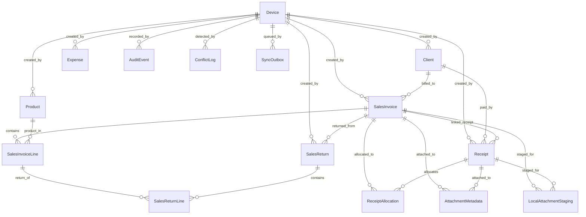

# Data Model: Core Data Model

**Branch**: `002-core-data-model` | **Date**: 2026-03-22

## Enums

### SyncStatus
- `PENDING` — not yet synced
- `SYNCED` — successfully synced to cloud
- `CONFLICT` — conflict detected during sync
- `FAILED` — sync attempt failed

### RecordStatus
- `ACTIVE` — record is current and valid
- `VOIDED` — record has been cancelled/voided

### ExpenseCategory
- `OWNER_DRAW` — draw by owner (does not affect net profit)
- `PARTNER_DRAW` — draw by partner (does not affect net profit)
- `MARGIN_DRAW` — draw from margin account (does not affect net profit)
- `OPERATIONAL` — operational expense (included in net profit calculation)
- `PRODUCTION` — production expense (included in net profit calculation)

### ReceiptType
- `INVOICE_LINKED` — receipt linked to a specific invoice
- `GENERAL` — general client payment on account

### AuditOperation
- `CREATE` — entity was created
- `UPDATE` — entity was updated
- `VOID` — entity was voided/cancelled

### ConflictStatus
- `PENDING` — conflict awaiting user resolution
- `RESOLVED` — conflict has been resolved

### SyncOutboxStatus
- `PENDING` — queued for sync
- `IN_PROGRESS` — currently being synced
- `COMPLETED` — successfully synced
- `FAILED` — sync failed (will retry)

### ParentEntityType
- `SALES_INVOICE`
- `RECEIPT`
- `PRODUCT`
- `CLIENT`
- `EXPENSE`
- `SALES_RETURN`

### DevicePlatform
- `ANDROID`
- `WINDOWS`

---

## Entities

### Device

Master record for each physical device running the app.

| Field | Type | Constraints | Notes |
|-------|------|-------------|-------|
| id | UUID (text) | PK | Device identity |
| device_name | text | NOT NULL | Human-readable name |
| platform | DevicePlatform | NOT NULL | ANDROID or WINDOWS |
| device_code | text(4) | NOT NULL, UNIQUE | First 4 hex chars of UUID, used in invoice local_ref |
| next_invoice_sequence | integer | NOT NULL, DEFAULT 1 | Per-device counter for invoice local_ref |
| created_at | datetime | NOT NULL | |
| last_active_at | datetime | NOT NULL | |

**Indexes**: None beyond PK and UNIQUE on device_code.

---

### Product

Master data for items the business sells.

| Field | Type | Constraints | Notes |
|-------|------|-------------|-------|
| id | UUID (text) | PK | |
| name | text | NOT NULL, UNIQUE | Product name, must be unique |
| description | text | NULLABLE | Optional description |
| default_sale_price | integer | NOT NULL | Minor-unit integer (e.g., 125000 = 1250.00 YER) |
| is_active | boolean | NOT NULL, DEFAULT true | false = disabled (never hard-deleted) |
| created_at | datetime | NOT NULL | |
| updated_at | datetime | NOT NULL | |
| device_id | UUID (text) | NOT NULL, FK → Device | Origin device |
| row_version | integer | NOT NULL, DEFAULT 1 | For sync conflict detection |
| sync_status | SyncStatus | NOT NULL, DEFAULT PENDING | |

**Indexes**: `idx_product_name` on `name`.

---

### Client

Master data for customers.

| Field | Type | Constraints | Notes |
|-------|------|-------------|-------|
| id | UUID (text) | PK | |
| display_name | text | NOT NULL | NOT unique (same-name clients allowed) |
| phone | text | NULLABLE | Additional identifying field |
| note | text | NULLABLE | Additional identifying field |
| client_code | text | NULLABLE | Additional identifying field |
| is_active | boolean | NOT NULL, DEFAULT true | |
| created_at | datetime | NOT NULL | |
| updated_at | datetime | NOT NULL | |
| device_id | UUID (text) | NOT NULL, FK → Device | Origin device |
| row_version | integer | NOT NULL, DEFAULT 1 | |
| sync_status | SyncStatus | NOT NULL, DEFAULT PENDING | |

**Indexes**: `idx_client_display_name` on `display_name`.

---

### SalesInvoice

Financial transaction representing a sale to a client.

| Field | Type | Constraints | Notes |
|-------|------|-------------|-------|
| id | UUID (text) | PK | |
| local_ref | text | NOT NULL, UNIQUE | Format: `INV-<deviceCode>-<localSequence>` |
| official_no | text | NULLABLE | Reserved for future authoritative numbering (null in MVP) |
| client_id | UUID (text) | NOT NULL, FK → Client | Mandatory client reference |
| invoice_date | datetime | NOT NULL | |
| discount | integer | NOT NULL, DEFAULT 0 | Invoice-level discount (minor-unit integer) |
| total | integer | NOT NULL | Computed: Σ(line totals) − discount |
| note | text | NULLABLE | |
| status | RecordStatus | NOT NULL, DEFAULT ACTIVE | |
| void_reason | text | NULLABLE | Required when status = VOIDED |
| created_at | datetime | NOT NULL | |
| updated_at | datetime | NOT NULL | |
| device_id | UUID (text) | NOT NULL, FK → Device | Origin device |
| row_version | integer | NOT NULL, DEFAULT 1 | |
| sync_status | SyncStatus | NOT NULL, DEFAULT PENDING | |

**Indexes**: `idx_invoice_date` on `invoice_date`, `idx_invoice_client` on `client_id`, `idx_invoice_status` on `status`.

---

### SalesInvoiceLine

Line item within an invoice.

| Field | Type | Constraints | Notes |
|-------|------|-------------|-------|
| id | UUID (text) | PK | |
| invoice_id | UUID (text) | NOT NULL, FK → SalesInvoice | Parent invoice |
| product_id | UUID (text) | NOT NULL, FK → Product | Referenced product |
| quantity | integer | NOT NULL | Must be > 0 |
| unit_price | integer | NOT NULL | Minor-unit integer (may differ from product default) |
| line_total | integer | NOT NULL | = quantity × unit_price |
| created_at | datetime | NOT NULL | |
| updated_at | datetime | NOT NULL | |

**Indexes**: `idx_invoice_line_invoice` on `invoice_id`.

---

### Receipt

Financial record of a payment.

| Field | Type | Constraints | Notes |
|-------|------|-------------|-------|
| id | UUID (text) | PK | |
| receipt_type | ReceiptType | NOT NULL | INVOICE_LINKED or GENERAL |
| client_id | UUID (text) | NOT NULL, FK → Client | |
| invoice_id | UUID (text) | NULLABLE, FK → SalesInvoice | Set for INVOICE_LINKED type, null for GENERAL |
| amount | integer | NOT NULL | Minor-unit integer |
| receipt_date | datetime | NOT NULL | |
| note | text | NULLABLE | |
| status | RecordStatus | NOT NULL, DEFAULT ACTIVE | |
| void_reason | text | NULLABLE | |
| created_at | datetime | NOT NULL | |
| updated_at | datetime | NOT NULL | |
| device_id | UUID (text) | NOT NULL, FK → Device | |
| row_version | integer | NOT NULL, DEFAULT 1 | |
| sync_status | SyncStatus | NOT NULL, DEFAULT PENDING | |

**Indexes**: `idx_receipt_client` on `client_id`, `idx_receipt_date` on `receipt_date`, `idx_receipt_status` on `status`.

---

### ReceiptAllocation

Explicit allocation linking a receipt to an invoice with a specific amount.

| Field | Type | Constraints | Notes |
|-------|------|-------------|-------|
| id | UUID (text) | PK | |
| receipt_id | UUID (text) | NOT NULL, FK → Receipt | |
| invoice_id | UUID (text) | NOT NULL, FK → SalesInvoice | |
| allocated_amount | integer | NOT NULL | Minor-unit integer |
| created_at | datetime | NOT NULL | |
| updated_at | datetime | NOT NULL | |

**Indexes**: `idx_allocation_receipt` on `receipt_id`, `idx_allocation_invoice` on `invoice_id`.

---

### Expense

Financial record of a business outflow.

| Field | Type | Constraints | Notes |
|-------|------|-------------|-------|
| id | UUID (text) | PK | |
| category | ExpenseCategory | NOT NULL | One of 5 approved categories |
| amount | integer | NOT NULL | Minor-unit integer |
| expense_date | datetime | NOT NULL | |
| note | text | NULLABLE | |
| status | RecordStatus | NOT NULL, DEFAULT ACTIVE | |
| void_reason | text | NULLABLE | |
| created_at | datetime | NOT NULL | |
| updated_at | datetime | NOT NULL | |
| device_id | UUID (text) | NOT NULL, FK → Device | |
| row_version | integer | NOT NULL, DEFAULT 1 | |
| sync_status | SyncStatus | NOT NULL, DEFAULT PENDING | |

**Indexes**: `idx_expense_date` on `expense_date`, `idx_expense_category` on `category`, `idx_expense_status` on `status`.

---

### SalesReturn

Financial record of a partial return against an invoice.

| Field | Type | Constraints | Notes |
|-------|------|-------------|-------|
| id | UUID (text) | PK | |
| invoice_id | UUID (text) | NOT NULL, FK → SalesInvoice | Parent invoice being returned against |
| return_date | datetime | NOT NULL | |
| total_returned_amount | integer | NOT NULL | Sum of return line amounts (minor-unit integer) |
| note | text | NULLABLE | |
| status | RecordStatus | NOT NULL, DEFAULT ACTIVE | |
| void_reason | text | NULLABLE | |
| created_at | datetime | NOT NULL | |
| updated_at | datetime | NOT NULL | |
| device_id | UUID (text) | NOT NULL, FK → Device | |
| row_version | integer | NOT NULL, DEFAULT 1 | |
| sync_status | SyncStatus | NOT NULL, DEFAULT PENDING | |

**Indexes**: `idx_return_invoice` on `invoice_id`, `idx_return_date` on `return_date`, `idx_return_status` on `status`.

---

### SalesReturnLine

Line item within a return.

| Field | Type | Constraints | Notes |
|-------|------|-------------|-------|
| id | UUID (text) | PK | |
| return_id | UUID (text) | NOT NULL, FK → SalesReturn | Parent return |
| invoice_line_id | UUID (text) | NOT NULL, FK → SalesInvoiceLine | Original invoice line |
| returned_quantity | integer | NOT NULL | Must be > 0 |
| returned_amount | integer | NOT NULL | Minor-unit integer |
| created_at | datetime | NOT NULL | |
| updated_at | datetime | NOT NULL | |

**Indexes**: `idx_return_line_return` on `return_id`.

---

### AttachmentMetadata

Storage reference for a file linked to an invoice or receipt.

| Field | Type | Constraints | Notes |
|-------|------|-------------|-------|
| id | UUID (text) | PK | |
| parent_entity_type | ParentEntityType | NOT NULL | Must be SALES_INVOICE or RECEIPT |
| parent_entity_id | UUID (text) | NOT NULL | ID of the parent invoice or receipt |
| storage_reference | text | NOT NULL | Cloudinary public ID or asset reference |
| secure_url | text | NULLABLE | Cloudinary secure URL (may be null if not yet uploaded) |
| file_type | text | NOT NULL | MIME type (e.g., image/jpeg) |
| file_size | integer | NULLABLE | File size in bytes |
| created_at | datetime | NOT NULL | |
| updated_at | datetime | NOT NULL | |
| device_id | UUID (text) | NOT NULL, FK → Device | |
| row_version | integer | NOT NULL, DEFAULT 1 | |
| sync_status | SyncStatus | NOT NULL, DEFAULT PENDING | |

**Indexes**: `idx_attachment_parent` on (`parent_entity_type`, `parent_entity_id`).

---

### LocalAttachmentStaging

Offline queue for attachments captured without connectivity.

| Field | Type | Constraints | Notes |
|-------|------|-------------|-------|
| id | UUID (text) | PK | |
| parent_entity_type | ParentEntityType | NOT NULL | Must be SALES_INVOICE or RECEIPT |
| parent_entity_id | UUID (text) | NOT NULL | |
| local_file_path | text | NOT NULL | Absolute path to the local file |
| file_type | text | NOT NULL | MIME type |
| file_size | integer | NULLABLE | |
| upload_status | text | NOT NULL, DEFAULT 'PENDING' | PENDING, UPLOADING, COMPLETED, FAILED |
| created_at | datetime | NOT NULL | |
| updated_at | datetime | NOT NULL | |

**Indexes**: `idx_staging_upload_status` on `upload_status`.

---

### AuditEvent

Immutable log entry for every financial mutation.

| Field | Type | Constraints | Notes |
|-------|------|-------------|-------|
| id | UUID (text) | PK | |
| entity_type | ParentEntityType | NOT NULL | Type of entity that was mutated |
| entity_id | UUID (text) | NOT NULL | ID of the mutated entity |
| operation | AuditOperation | NOT NULL | CREATE, UPDATE, or VOID |
| diff_data | text | NOT NULL | JSON: changed fields only (expanded for voids/returns/allocations) |
| device_id | UUID (text) | NOT NULL, FK → Device | Device that performed the mutation |
| created_at | datetime | NOT NULL | Immutable timestamp |

**Constraints**: No UPDATE or DELETE allowed (immutability enforced at application level).
**Indexes**: `idx_audit_entity` on (`entity_type`, `entity_id`), `idx_audit_created` on `created_at`.

---

### ConflictLog

Explicit record of a sync conflict between devices.

| Field | Type | Constraints | Notes |
|-------|------|-------------|-------|
| id | UUID (text) | PK | |
| entity_type | ParentEntityType | NOT NULL | |
| entity_id | UUID (text) | NOT NULL | |
| local_payload | text | NOT NULL | JSON snapshot of local version |
| remote_payload | text | NOT NULL | JSON snapshot of server version |
| conflict_type | text | NOT NULL | Description of the conflict (e.g., "amount_mismatch") |
| resolution_status | ConflictStatus | NOT NULL, DEFAULT PENDING | |
| resolved_at | datetime | NULLABLE | |
| resolution_data | text | NULLABLE | JSON: which version was chosen / how resolved |
| created_at | datetime | NOT NULL | |
| device_id | UUID (text) | NOT NULL, FK → Device | Device that detected the conflict |

**Indexes**: `idx_conflict_entity` on (`entity_type`, `entity_id`), `idx_conflict_status` on `resolution_status`.

---

### SyncOutbox

Mutation queue for offline-first sync.

| Field | Type | Constraints | Notes |
|-------|------|-------------|-------|
| id | UUID (text) | PK | |
| entity_type | ParentEntityType | NOT NULL | |
| entity_id | UUID (text) | NOT NULL | |
| operation | AuditOperation | NOT NULL | CREATE, UPDATE, or VOID |
| payload | text | NOT NULL | JSON payload to send to server |
| row_version | integer | NOT NULL | Row version at time of mutation |
| device_id | UUID (text) | NOT NULL, FK → Device | |
| retry_count | integer | NOT NULL, DEFAULT 0 | |
| status | SyncOutboxStatus | NOT NULL, DEFAULT PENDING | |
| created_at | datetime | NOT NULL | |

**Indexes**: `idx_outbox_status` on `status`, `idx_outbox_created` on `created_at`.

---

### SyncCursor

Tracks sync progress per entity type.

| Field | Type | Constraints | Notes |
|-------|------|-------------|-------|
| id | UUID (text) | PK | |
| entity_type | ParentEntityType | NOT NULL, UNIQUE | One cursor per entity type |
| last_pulled_at | datetime | NULLABLE | Timestamp of last successful pull |
| last_row_version | integer | NOT NULL, DEFAULT 0 | Highest row version received from server |
| updated_at | datetime | NOT NULL | |

**Indexes**: `idx_cursor_entity_type` on `entity_type` (covered by UNIQUE).

---

## Relationships Diagram

